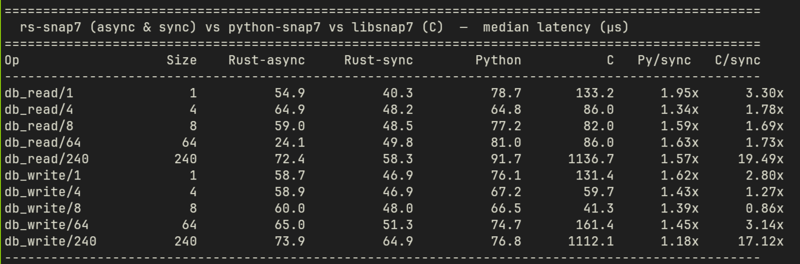

# rs-snap7

Pure-Rust, async implementation of the Siemens S7 protocol stack. Communicates with S7-300/400/1200/1500 PLCs over ISO-on-TCP without any native C dependency.

> **Status:** v0.1.4 — functional, pre-1.0. API may change.

## Features

| Capability | Status |
|---|---|
| **S7Comm** (S7-300/400) — read/write DB, multi-area, blocks, SZL | ✅ |
| **S7CommPlus** (S7-1200/1500 integrity mode) — read/write DB | ✅ |
| **TLS transport** (S7CommPlus encrypted mode) | ✅ |
| **UDP transport** | ✅ |
| **Connection pool** | ✅ |
| **Multi-read / multi-write** with automatic PDU batching | ✅ |
| **PLC control** — stop, hot-start, cold-start, status | ✅ |
| **PLC information** — order code, CPU info, CP info, module list | ✅ |
| **Block operations** — list, info, upload, download, delete, fill | ✅ |
| **Session password** — set, clear, read protection level | ✅ |
| **SZL queries** — system status list | ✅ |
| **PLC clock read** | ✅ |
| **Copy RAM → ROM, compress memory** | ✅ |
| **CLI** — typed tags, multi-format output (text/json/csv) | ✅ |
| **OPC-UA gateway** with subscription support | ✅ |
| **In-process PLC simulator** with data store, callbacks, CPU state | ✅ |

## Workspace crates

| Crate | Description |
|---|---|
| [`snap7-client`](crates/snap7-client) | Async PLC client (`S7Client`, `S7PlusClient`, connection pool, TLS, UDP) — includes protocol layer |
| [`snap7-server`](crates/snap7-server) | In-process PLC simulator for testing with data store, callbacks, CPU state |
| [`snap7-opcua-gateway`](crates/snap7-opcua-gateway) | OPC-UA bridge with subscription support |
| [`snap7-cli`](snap7-cli) | CLI binary (`snap7`) + helper servers |

---

## Benchmarks

Median latency (µs) — rs-snap7 vs python-snap7 vs libsnap7 (C), measured against an in-process simulator:



Rust sync is consistently **1.2–2.0× faster than python-snap7** and **up to 19× faster than libsnap7 (C)** at larger payload sizes.

---

## Install CLI binaries

```bash
# Main CLI
cargo install snap7-cli --bin snap7

# Test server (simulated PLC)
cargo install snap7-cli --bin snap7-test-server

# Sensor server (simulated PLC with live-updating REAL values)
cargo install snap7-cli --bin snap7-sensor-server

# OPC-UA gateway + demo tools (requires opcua feature)
cargo install snap7-cli --features opcua --bin gateway_demo
cargo install snap7-cli --features opcua --bin plc_batch_reader
cargo install snap7-cli --features opcua --bin opcua_subscriber
```

---

## Quick start

### Connect to a real PLC

```bash
# Read 16 bytes from DB1 at offset 0
snap7 -H 192.168.1.100 read --db 1 --offset 0 --size 16

# Write bytes (hex) to DB2 at offset 4
snap7 -H 192.168.1.100 write --db 2 --offset 4 --data DEADBEEF

# Read a typed tag
snap7 -H 192.168.1.100 tag read DB1,REAL0
snap7 -H 192.168.1.100 tag read DB70,332.0       # bit access

# Write a typed tag
snap7 -H 192.168.1.100 tag write DB1,REAL0 3.14
snap7 -H 192.168.1.100 tag write DB10,DINT0 42

# Watch a tag (poll every 500 ms, print on change only)
snap7 -H 192.168.1.100 watch --db 1 --offset 0 --size 4 --interval-ms 500 --changes-only

# Block operations
snap7 -H 192.168.1.100 block list
snap7 -H 192.168.1.100 block info --type OB --number 1
snap7 -H 192.168.1.100 block upload --type OB --number 1 --out ob1.bin

# Query SZL (system status list)
snap7 -H 192.168.1.100 szl --id 0x0011 --index 0

# PLC control
snap7 -H 192.168.1.100 plc-control status
snap7 -H 192.168.1.100 plc-control stop
snap7 -H 192.168.1.100 plc-control hotstart
snap7 -H 192.168.1.100 plc-control coldstart

# PLC information
snap7 -H 192.168.1.100 info order-code
snap7 -H 192.168.1.100 info cpu-info
snap7 -H 192.168.1.100 info cp-info

# Session password
snap7 -H 192.168.1.100 password set mypass
snap7 -H 192.168.1.100 password clear

# Run diagnostics
snap7 -H 192.168.1.100 diag
```

### TLS and UDP transport

```bash
# S7CommPlus with TLS (S7-1200/1500)
snap7 -H 192.168.1.100 --tls read --db 1 --offset 0 --size 4

# With custom CA certificate
snap7 -H 192.168.1.100 --tls --tls-ca /path/to/ca.pem read --db 1 --offset 0 --size 4

# UDP transport (ISO-on-UDP)
snap7 -H 192.168.1.100 --udp read --db 1 --offset 0 --size 4
```

### Use the simulator locally

```bash
# Terminal 1 — start test server on port 10200
snap7-test-server

# Terminal 2 — read from it
snap7 -H 127.0.0.1 -p 10200 read --db 1 --offset 0 --size 4
# → DE AD BE EF
```

### Tag address syntax

```
DB<n>,<type><offset>
DB<n>,<offset>.<bit>
```

| Type | Width | Example |
|---|---|---|
| `REAL` | 4 bytes | `DB1,REAL0` |
| `DINT` | 4 bytes | `DB1,DINT4` |
| `DWORD` | 4 bytes | `DB1,DWORD4` |
| `INT` | 2 bytes | `DB1,INT8` |
| `WORD` | 2 bytes | `DB1,WORD8` |
| `BYTE` | 1 byte | `DB1,BYTE10` |
| bit | 1 bit | `DB1,332.0` |

### Output formats

```bash
snap7 -H 192.168.1.100 -f json  tag read DB1,REAL0
snap7 -H 192.168.1.100 -f csv   tag read DB1,REAL0
snap7 -H 192.168.1.100 -f text  tag read DB1,REAL0   # default
```

---

## Use as a library

Add to `Cargo.toml`:

```toml
[dependencies]
snap7-client = { git = "https://github.com/cool0looc/rs-snap7" }
```

### Async client (S7Comm — S7-300/400)

```rust
use snap7_client::{S7Client, ConnectParams};
use snap7_client::transport::TcpTransport;
use std::net::SocketAddr;
use std::time::Duration;

#[tokio::main]
async fn main() -> anyhow::Result<()> {
    let addr: SocketAddr = "192.168.1.100:102".parse()?;
    let params = ConnectParams {
        rack: 0,
        slot: 1,
        connect_timeout: Duration::from_secs(5),
        ..Default::default()
    };

    let client = S7Client::<TcpTransport>::connect(addr, params).await?;

    // Read 4 bytes from DB1 offset 0
    let data = client.read_db(1, 0, 4).await?;
    println!("{data:?}");

    // Write
    client.write_db(1, 0, &[0xDE, 0xAD, 0xBE, 0xEF]).await?;

    // Multi-read (one PDU, automatic batching)
    use snap7_client::MultiReadItem;
    let items = vec![
        MultiReadItem::db(1, 0, 4),
        MultiReadItem::db(2, 0, 2),
    ];
    let results = client.read_multi_vars(&items).await?;

    // Multi-write (one PDU, automatic batching)
    use snap7_client::MultiWriteItem;
    let items = vec![
        MultiWriteItem::db(1, 0, vec![0xAA, 0xBB]),
        MultiWriteItem::db(2, 10, vec![0x01, 0x02]),
    ];
    client.write_multi_vars(&items).await?;

    // Absolute area read/write (any area, not just DB)
    use snap7_client::proto::s7::header::Area;
    let data = client.ab_read(Area::Merker, 0, 0, 4).await?;
    client.ab_write(Area::ProcessOutputs, 0, 0, &[0x00]).await?;

    Ok(())
}
```

### S7CommPlus client (S7-1200/1500 integrity mode)

```rust
use snap7_client::S7PlusClient;
use std::net::SocketAddr;

#[tokio::main]
async fn main() -> anyhow::Result<()> {
    let addr: SocketAddr = "192.168.1.100:102".parse()?;
    let client = S7PlusClient::connect(addr, Default::default()).await?;

    let data = client.db_read(1, 0, 4).await?;
    println!("{data:?}");

    client.db_write(1, 0, &[0xDE, 0xAD, 0xBE, 0xEF]).await?;

    // Multi-read
    use snap7_client::plus_client::DbVarSpec;
    let specs = vec![
        DbVarSpec { db: 1, offset: 0, length: 4 },
        DbVarSpec { db: 2, offset: 0, length: 2 },
    ];
    let results = client.read_multi_vars(&specs).await?;

    // TLS connection (S7CommPlus over TLS)
    let client = S7PlusClient::connect_tls(
        addr, "plc.example.com", None, Default::default()
    ).await?;

    Ok(())
}
```

### PLC control & information

```rust
// Read PLC status (RUN / STOP)
let status = client.get_plc_status().await?;

// Control the PLC
client.plc_stop().await?;
client.plc_hot_start().await?;
client.plc_cold_start().await?;

// Read order code (e.g. "6ES7 317-2EK14-0AB0")
let oc = client.get_order_code().await?;
println!("Order code: {}", oc.code);

// Read detailed CPU info
let ci = client.get_cpu_info().await?;
println!("Module: {}", ci.module_type);
println!("Serial: {}", ci.serial_number);

// Read CP info (max PDU size, connections, baud rates)
let cp = client.get_cp_info().await?;

// Read module list
let modules = client.read_module_list().await?;
```

### Block operations

```rust
// List all blocks
let list = client.list_blocks().await?;
for entry in &list.entries {
    println!("Type 0x{:04X}: {} blocks", entry.block_type, entry.count);
}

// Get detailed block info
let info = client.get_ag_block_info(0x41, 1).await?; // DB 1
println!("Size: {} bytes", info.size);
println!("Author: {}", info.author);

// Upload a block (Diagra format)
let data = client.upload(0x41, 1).await?; // DB 1
if let Some(bd) = snap7_client::BlockData::from_bytes(&data) {
    println!("Uploaded block {} bytes", bd.total_length);
}

// Download a block
client.download(0x41, 1, &data).await?;

// Delete a block
client.delete_block(0x41, 1).await?;

// Fill a DB with constant value
client.db_fill(1, 0x00).await?;
```

### Session password & protection

```rust
// Set session password
client.set_session_password("mypass").await?;

// Clear session password
client.clear_session_password().await?;

// Read protection level
let protection = client.get_protection().await?;
println!("Password set: {}", protection.password_set);
println!("Level: {}", protection.level);
```

### Other client operations

```rust
// Read PLC clock
let dt = client.read_clock().await?;

// Copy RAM to ROM (retain on power-off)
client.copy_ram_to_rom().await?;

// Compress PLC work memory (must be in STOP)
client.compress().await?;

// Runtime parameter adjustment
let timeout = client.request_timeout();
client.set_request_timeout(std::time::Duration::from_secs(3)).await;
```

### Connection pool

```rust
use snap7_client::{S7Pool, PoolConfig, ConnectParams};
use std::net::SocketAddr;

let addr: SocketAddr = "192.168.1.100:102".parse()?;
let params = ConnectParams::default();
let config = PoolConfig { max_size: 4, ..Default::default() };

let pool = S7Pool::new(addr, params, config);
let client = pool.get().await?;
client.read_db(1, 0, 4).await?;
```

### Embed a test server

```rust
use snap7_server::{S7Server, ServerConfig, DataStore, CpuState};
use std::net::SocketAddr;

let store = DataStore::new();
store.write_bytes(1, 0, &[1, 2, 3, 4]);

// Area registration (required for non-DB reads)
store.register_area(0x81, 1024);   // process inputs
store.register_area(0x82, 1024);   // process outputs

// CPU state tracking
store.set_cpu_state(CpuState::Run);

// Event callbacks
store.on_read(|info| {
    println!("Read  area=0x{:02X} db={}", info.area, info.db_number);
});
store.on_write(|info| {
    println!("Write area=0x{:02X} db={}", info.area, info.db_number);
});

let cfg = ServerConfig {
    bind_addr: "127.0.0.1:0".parse()?,
    max_connections: 8,
};
let server = S7Server::bind(cfg).await?;
let addr = server.local_addr()?;

tokio::spawn(server.serve(store));
// addr is now ready to accept S7 connections
```

### UDP transport

```rust
use snap7_client::{S7Client, ConnectParams, UdpTransport};
use std::net::SocketAddr;

let addr: SocketAddr = "192.168.1.100:102".parse()?;
let client = S7Client::<UdpTransport>::connect_udp(addr, ConnectParams::default()).await?;
let data = client.db_read(1, 0, 4).await?;
```

---

## OPC-UA gateway

The `snap7-opcua-gateway` crate (and `snap7 serve` command) bridges a PLC to OPC-UA clients with full subscription support.

```toml
# gateway.toml
plc_addr = "192.168.1.100:102"
opc_endpoint = "opc.tcp://0.0.0.0:4840"
poll_interval_ms = 500

[[tags]]
name = "Temperature"
tag = "DB1,REAL0"
writable = false

[[tags]]
name = "Setpoint"
tag = "DB2,REAL0"
writable = true
```

```bash
snap7 --features opcua serve --config gateway.toml
```

OPC-UA clients subscribe to `ns=2;s=Temperature` etc. and receive notifications at the polling interval. See [OPC-UA_SUBSCRIPTIONS.md](crates/snap7-opcua-gateway/OPC-UA_SUBSCRIPTIONS.md) for Python/Node.js subscription examples.

---

## Build from source

```bash
git clone https://github.com/cool0looc/rs-snap7
cd rs-snap7

# Build all
cargo build --release

# Build with OPC-UA gateway support
cargo build --release --features opcua -p snap7-cli

# Run tests
cargo test --workspace

# Run benchmarks
cargo bench -p snap7-bench
```

---

## License

MIT — see [LICENSE](LICENSE).
